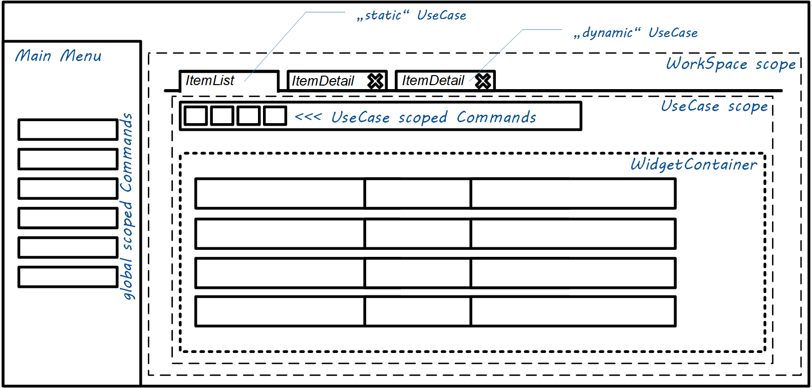

*Based on several prototypes from [KornSW](https://github.com/KornSW) since 2015, this document (which was created in 2019 and originated [here](https://kornsw.de/2019/core-ideas-for-a-universal-webshell/)) represents the key concept of the right level of abstraction to describe application use cases on a way that in suitable for rapid development AND professional products. Please don't rename or relocate this document, because it is referenced by external deep-links!*


# Core ideas for a universal Webshell

This is the idea of building a 'universal' shell in the form of an SPA that can host any web application. The current paradigm of configurable application modules (keyword 'composite application') in combination with the "WebComponents" standard enables us to create a product which is put together from several decentrally hosted components. In addition, an interaction between these modules should be made possible. In addition, it should also be possible to define various standard use cases, such as processing a list of data records in the form of simple CRUD operations, purely configuratively. In the latter case, no frontend development is necessary at all - only a web service in the Backend...


## Abstraction


### what is a 'Workspace'

A Workspace is some kind of Desk which is dedicated for a working concern. Like in real life, where you have a kitchen-desk for cooking, a desk in you Workshop for doing handi tasks and a desk in you home office, an application can also have multiple workspaces for high-level grouping of usecases or supporting different roles/working modes of users.

A workspace is declared as follows:

| Attribute                    | DataType                | Semantic                                                     |
| ---------------------------- | ----------------------- | ------------------------------------------------------------ |
| workspaceKey                 | string                  | an identifier which is used to address a workspace (also used for url's and routing) |
| ~~defaultStaticUseCaseKeys~~ | string-array (optional) | ~~0..* useCaseKeys that should be permanently present within the workspace (there will be no way to terminate them). If a workspace can be navigated via menu entry, then it makes sense, that is will not appear empty when its initially shown.~~ OBSOLETE! static usecases now assigned using a separate section (see below) |
| ~~isSidebar~~                | boolean (optional)      | ~~if true, then the workspace will be displayed as a collapsible Sidebar on the right side of the application instead of the main area.~~ OBSOLETE: use "workspaceAppearence=sidebar" instead |
| workspaceAppearance          | string (optional)       | "default" (in center area) \| "sidebar" \| "modal"           |
| usecaseAppearance            | string (optional)       | "tabs" \| "flow" \| "dashboard"                              |

#### Sidebar

When enabling a workspace to be displayed in the sidebar, the default value for usecaseAppearance will be "flow" otherwise it would be "tabs". Note that just enabling the sidebar appearance will not automatically add a button to show the sidebar! The application will only have one button to expand a sidebar quickly, and this button is reserved for the workspace with the well-known workspaceKey "sidebar"! Anyone can add own static usecases to this common sidebar workspace (thats why we changed the way of declaration for that), but for own additional sidebars there must be declared a dedicated command for opening them.

#### Home

In default the initial view of the shell (except if a login is required) is the "home"-workspace. Which workspace to use (changing the name) can be overwritten in the application portfolio configuration (see "landingWorkspaceKey").

A Click on the logo/app-title will also navigate to this workspace.

Beside of "home" here are some suggestions for well-known workspace-names (navigatable via the user-menu ("MY")):

* "config": application configuration
* "settings": user scoped settings
* "account": user account information
* "legal": legal-notes, terms of use, licensing
* "help": help and documentations
* "debug": developer tools and diagnostic helpers

### what is a 'UseCase'

Within the application, a UseCase represents a transaction scope which

* has its **own State (the 'UnitOfWork')**

 * has a **UI representation** in form of:
    *  a **Tab (within a parent workspace)**, 
    * a **dedicated toolbar** for triggering commands, that are coupled to the current UnitOfWork
    * a **'Widget'**, to render specific components for example to display some data from the current UnitOfWork

A usecase is declared as follows:

| Attribute          | DataType              | Semantic                                                     |
| ------------------ | --------------------- | ------------------------------------------------------------ |
| useCaseKey         | string                | an identifier which is used to address a usecase             |
| title              | string                | is used as label for the tab, representing the usecase. Its also possible to use placeholders with the name of a state attribute (sample: *'Details of Record #{recordIdToEdit}'*) |
| instanceKey        | string (optional)     | used to control concurrency of identical UseCases - this is described in detail below... the default is *'{uid}'* |
| widgetClass        | string                | the widget which should be used in the UI. for detail see section 'Remote-Widgets' below |
| unitOfWorkDefaults | dictionary (optional) | defines which fields the workingState of a usecase should contain  (sample: *'{ "recordToEditId": null, "showAdvancedFields":false}'*). This values can be overwritten with individual valvues passed by the command, which is initiating a usecase. |
| icon               | string                | key of an icon to be displayed in the tab                    |


### what is a 'Widget'

It is a UI Component which **displays the** state oder data of the underlying **UnitOfWork** to the user. Exactly the edge between UnitOfWork and the presenter-logic of the widget represents a cut where we can apply the decentralization aspect. Because a Widget can be served from a application module which is hosted externally (see the **'Remote-Widgets'** section below).


### what is a 'Command'

It is a action, that can be triggered by the user when interacting with the UI. It must not have any input arguments. If some **arguments** are required to execute the action, then they must be **pulled from the ambient state** of the current scope or (if not present) requested by an modal input dialog.


## Layout





## State Handling


### UseCase-States

All states, also for those usecases which are served via Remote-Widgets, are managed by the Shell. The state is just an dictionary-object which contains named attributes specific to the current usecase. A handle to this object is passed into the widget during its initialization. The widget must not have any internally manged state/variable. It needs to work directly and in real-time on the given dictionary.

**Well known** state attributes:

| Attribute | DataType | Semantic                                                     |
| --------- | -------- | ------------------------------------------------------------ |
| changes   | boolean  | the "dirty marker" (requires also, that there is a usecase-action named *'commit()'*). This special state will automatically result in a '*'-char, that will automatically appended to the label of the usecase tab. |

### State preservation

The Shell uses the 'localstore' of the browser to preserve all the UseCase States is a way, that allows a complete restore of all usecases and especially their transactional state (UnitOfWork) when the browser was closed. So it needs to be permanently in sync. The responsibility for this lies alone in the Shell.


### The "RuntimeTags"

Are boolean predicates, with the semantic of runtime 'Feature Toggles' for the Application. They can be used to Enable/Disable, Show/Hide several command triggers in the UI. A good example are toggles for an "Expert-Mode", "Feature-Preview" or the user-confirmation of some legal-agreement before a feature is accessible.


## Command-Types

There are several different command types! But before we take a look on the differences, we should declare the basics (which are present for any command type):

### Basic Attributes

| Attribute                          | DataType                | Semantic                                                     |
| ---------------------------------- | ----------------------- | ------------------------------------------------------------ |
| uniqueCommandKey                   | string                  | an identifier which is used to address a command             |
| label                              | string                  | the label for the TriggerButton                              |
| semantic                           | string (optional)       | controls only the UI color-theming. can be one of the following constants: 'primary' or 'secondary' or 'success' or 'info' or 'warning' or 'help' or 'danger'. default is 'primary'. |
| description                        | string (optional)       | will be displayed as tooltip for the TriggerButton           |
| icon                               | string (optional)       | key of the icon                                              |
| iconChecked                        | string (optional)       | key of the icon, when the command is rendered in checked-state (which depends on the 'checkedRepresentingRuntimeTag'). If no icon is defined here, then the regular 'icon' is used as fallback. |
| WarningToConfirm                   | string (optional)       | Some convenience, to easily require a confirmation before triggering the action. Its the classical "are you sure?"-popup. It is activated, when a string is specified here! |
| requiredRuntimeTagsForAvailability | string-array (optional) | 0..* RuntimeTags, that are evaluated AND-linked to represent the fact that the TriggerButton is ENABLED |
| requiredRuntimeTagsForVisibility   | string-array (optional) | 0..* RuntimeTags, that are evaluated AND-linked to represent the fact that the TriggerButton is VISIBLE |
| checkedRepresentingRuntimeTag      | string (optional)       | a RuntimeTag, that is evaluated to represent the fact that the TriggerButton is rendered as 'checked' (different icon) |
| locateAfterCommand                 | string (optional)       | uniqueCommandKey of another command within the same menu which is used as start point when  inserting the TriggerButton inti the menu. |
| locationPriority                   | integer (optional)      | when there is no command available to locate the TriggerButton after, then the order can be arranged by setting the locationPriority. The default is 100. |
| menuOwnerUseCaseKey                | string (optional)       | if a UseCaseKey is specified, that the command will be scoped to this usecase and a UI TriggerButton will be shown in the toolbar of this usecase. Otherwise the TriggerButton will be shown in the main menu of the application. |
| menuFolder                         | string                  | a path (separated by '/' characters) to specify the location in the target menu-structure where the entry will be added. Note: an empty string to address the 'root' is only supported for usecase specific toolbar-buttons, but not for the main-menu (this will automatically fallback to 'MISC\\'). In addition to that, there is the magic value 'MY', which can be used to insert triggers into the "UserMenu"on the upper-right of the application headline. |
| commandType                        | string                  | one of the supported command-types that a described below... |


### The "activate-workspace"-Command

Initiates UI navigation to a workspace route including the initialization of "Static Usecases" (if the workspace contains some)

| Attribute          | DataType | Semantic                              |
| ------------------ | -------- | ------------------------------------- |
| targetWorkspaceKey | string   | addresses the workspace to 'activate' |


### The "start-usecase"-Command

| Attribute          | DataType          | Semantic                                                     |
| ------------------ | ----------------- | ------------------------------------------------------------ |
| targetWorkspaceKey | string (optional) | addresses the workspace to add the workspace to. if no workspace is provided, then the usecase will start in form of a modal dialog. "." can be used to address the parent  workspace of the current usecase (only if the command is  useCase scoped) |
| useCaseKey         | string            | the usecase to start (or activate if it is a singleton-usecase) |
| initUnitOfWork     | dictionary        | Provides values to be passed as initial state for the UOW for the new usecase instance. There values can be hard coded and/or mapped using the 'mapDynamic'-Approach |


### The "usecase-action"-Command

This command...

| Attribute             | DataType              | Semantic                                                     |
| --------------------- | --------------------- | ------------------------------------------------------------ |
| actionName            | string                | name of a method that is either a wellknown method for controlling the usecases (like 'endUseCase') or the name of a functions that is implemented on the widget (like *'selectAll'* or *'resetFilter'*). |
| actionArgumentMapping | dictionary (optional) | maps attribute names from the ambient state of the current usecase scope to input parameter names for the method to invoke. Sample: *{ "itemIdToDelete":"selectedItemId" }* |


### The "backend-action"-Command

| Attribute             | DataType              | Semantic                                                     |
| --------------------- | --------------------- | ------------------------------------------------------------ |
| actionName            | string                | name of a method that is either a registered backend action, which is triggered via webservice-call (like *'generateDocuments'*). |
| actionArgumentMapping | dictionary (optional) | maps attribute names from the ambient state of the current usecase scope to input parameter names for the method to invoke. Sample: *{ "itemIdToDelete":"selectedItemId" }* |


### The "set-runtime-tag"-Command

| Attribute | DataType     | Semantic                                                     |
| --------- | ------------ | ------------------------------------------------------------ |
| tagsToSet | string-array | one or multiple expressions to modify the current RuntimeTags. This can be *'tagName'* to set a tag, *'**!**tagName'* to negate/toggle a tag or *'**-**tagName'* to remove a tag. |


## Controlling UseCase instances


### UseCase Argument passing

see the 'useCaseArgumentMapping' as explained above...

### "Static" UseCases

If a workspace can be navigated via menu entry, then it makes sense, that it will not appear empty when its initially shown.  So static usecases are permanently present within a workspace (there will be no way to terminate them, and they are present directly when accessing a workspace). This can be declared using an "staticUseCaseAssignment" structure in the following way:


| Attribute          | DataType              | Semantic                                                     |
| ------------------ | --------------------- | ------------------------------------------------------------ |
| useCaseKey         | string                | the usecase to be present                                    |
| targetWorkspaceKey | string                | addresses the workspace that should contain the usecase      |
| initUnitOfWork     | dictionary (optional) | Provides values to be passed as initial state for the UOW for the new usecase instance. There values can be hard coded and/or mapped using the 'mapDynamic'-Approach |


### Concurrency of identical UseCases

The "instanceKey" which is generated using the given pattern can exist only once within the runtime.

If there is already a UseCase instance with a equal instanceKey, then the UI will just navigate to this useCase instead of initializing a new one during execution of a "start-usecase"-Command.

If there a unlimited concurrency is intended, then the *'{uid}'* placeholder can be used.

If a only one instance is allowed for the whole application (Singleton), then *'{UseCaseKey}'* can be used also as 'instanceKey'.

If only one EditItem or CreateNewItem UC for a certain entity is allowed, it would be a string like *'Myentity:EditOrCreate'*.

If a concrete record can only be opened for edit once, it would be *"EditMyentity-{itemToEditId}"*


## Decentralized Modules


### Remote-Widgets

for each UseCase exactly one corresponding component needs to be declared in the module configuration.

This can be an build-in or externally hosted UI. therefore we need to wrap each component into a 'ComponentHost'.

The following host-implementations are possible:

*  '***InternalComponentHost***' (just for components which are part of the SPA)

* '***ExternalReactComponentHost***' (embedding of UI artifacts from an external react application,

which goes ahead with a little more convenience / optimized communication)

* '***ExternalWebComponentHost***' (embedding of UI artifacts following the 'WebComponent' Standard)

* '***IFrameComponentHost***' (without the support of any convenience for communication)


The decision, which strategy is used is related to the syntax, how the *'widgetClass'* is specified for a usecase:

* "internal://widgetClassName" or 

* "react://widgetUrl" or 

* "webcomponent://widgetUrl" or 

* "http(s)://urlForIframe/?someArg={stateProperty}"


## Definition Files


### The "default.portfolio.json"

```
{
  "applicationTitle": "FOO",
  "oAuthProxyUrl": "https://xxxxxxx/oauth/",
  "oAuthProxyProfile": "xxxxxxx",
  "primaryUiTokenSourceUid": "4E888413-243B-22A9-6666-6AF84F43A12E",
  "shellLicenceKey":"JWT-with-content-inside",
  "authTokenSource": "frontend-generated-mode1",
  "authTokenSourceParam": { "iss": "xxx-SPA", "exp":"100D", "sub":"%U"},
  "authTokenIsPersistent": true,
  "ciConfigUrl": "foo.ci.json",
  "legalContactMdUrl": "legal-contact.md",
  "licenseAgreementMdUrl": "license-agreement.md",
  "moduleDescriptionUrls": [
    "https://any-external-source/module.json",
    "https://another-source/module.json"
  ],
  "intialRuntimeTags": ["Prod"],
  "landingWorkspaceKey": "home".
  "applicationScope" : {
     "Tenant": "Foo",
     "Product": "Bar"
  }
}
```


### The "ci.json"

```
{
  "logoUrlLight": "https://xxxx/downloads/xxxx.png",
  "logoUrlDark": "https://xxxx/downloads/xxxx.png",
  "menuMode":"horizontal",
  "pageColorMode": "light",
  "menuColorMode":"light",
  "topBarColorMode":"dim",
  "inputBgFilled": true,
  "componentTheme": "cyan"
}
```


### 'The "module.json"

```
{
  "moduleUid": "1B6CB9E8-4D5C-8481-4990-DA95321A818F",
  "moduleTitle":"xxxx Core-Module",
  "workspaces":[
    ... see description above ...
  ],
  "useCases": [
    ... see description above ...
  ],
  "staticUseCaseAssignments": [
    ... see description above ...
  ],
  "commands":[
       ... see description above ...
  ],
  -----------------------------------------------------
  vvv DRAFT vvv
  "dataSchema": {
    "Entities": [
        {
          "invariantTechnicalName": "...",
          "displayLabelSingular": "...",
          "displayLabelPlural": "...",
          "iconKeySingular":"...",
          "iconKeyPlural":"..."
        }
    ],
    "Relations": [
    ]
  },
  "dataSources":[
    {
      "dataSourceUid":"3FFD0BC8-A790-4EB3-49EA-AEA3A8B3E403",
      "entityName": "...",
      "provider": "rest-ujmw-crud-v1",
      "connectionParams": { "url": "http://..." },
      "readOnly": false,
      "searchableByKeyFields": true,
      "searchableByFulltext": true
    }
  ],
  "displayModels": [
    {
        "TargetEntityName":"...",
        "invisibleFields": [],
        "iconNameSingular":"...",
        "iconNamePlural":"..."
    }
  ],
  "handlers":[
    {
      "handlerUid":"{75130448-F728-2487-43D4-4D923A0AB579}",
      "requiredRuntimeTag": ["devmode"],
      "eventType":"after-command-triggered|after-tag-set|after-tag-removed|after-usecase-action|after-usecase-start|after-backend-action-failed/after-backend-action-completed"
    }
  ]
}

```


## Auth-Tokens

*TBD*...


------

*Copyright - T.Korn 2019*